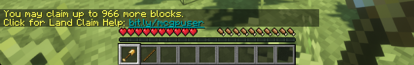
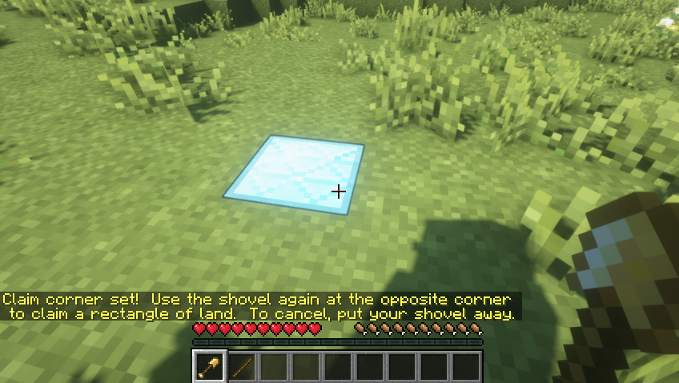
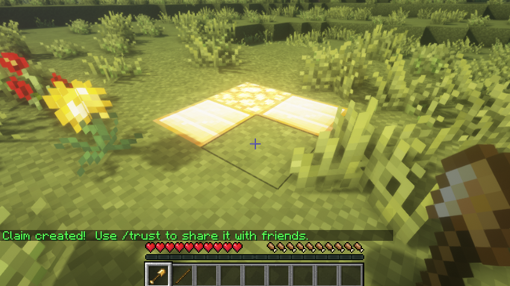
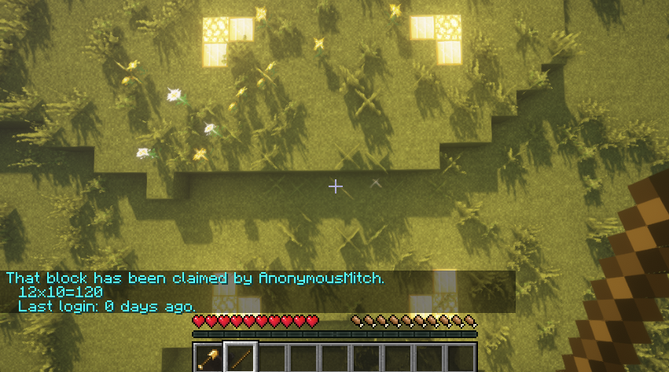

+++
type = "docs"
title = "Claiming land"
date = 2022-04-19T00:00:00+02:00
description = "How to protect your slice of heaven"
toc = true
+++

When claiming land you must have a minimum of 50 blocks selected. Anything less is too small and will not be accepted when attempting to claim. All claims go from Bedrock to the Sky Limit.

If, somehow, after reading this guide you are still unable to claim and protect your land, then please message a staff member, and we will do our best to help you!

## Claiming a piece of land

This section is going to walk you through the steps necessary to simply create a claim for your base. There will be information further below in order to manage/expand your claim in the future.

- Craft a golden shovel to start claiming, make sure to have a stick as well, so you can see the boundaries of a claim.
- Have a base or area marked out for where you want it to be claimed. Placing a block at each corner of your desired claim usually helps with the process!
- Place the Golden Shovel in your hand and find your way to one corner of your desired claim area. Then right-click this corner and a Diamond Block should appear. This is only a visual, don't bother trying to break it.
- Head over to the opposite corner of your desired claim. Do not un-equip or click with the Golden Shovel during this time. Once you are at the opposite corner, right-click the block. If done correctly, you should receive a message saying your claim has been created and there should be Gold and Glowstone Blocks around the boundary. If not, read chat and find out why it didn't work!
- You can see the boundary of your claim at any time by right-clicking with the Stick while standing inside your claim.

### Images

 

 

 

## Claiming extra blocks

In order to expand your claim, you need to have the claim blocks to do so. Each block you claim counts for a single claim block. However, it does not count the vertical blocks. You are able to view your remaining claim blocks by holding the Golden Shovel and looking in chat.

Gaining claim blocks is as simple as playing on the servers! For every hour you play you gain 200 claim blocks and you start with 500.

## Managing your claim

Now that you’ve got a claim, you’re going to need to manage it. This involves expanding, changing permissions, adding trusted players and much more! Here will be a list of commands associated with managing your claim, how to use them and what they do.

**/abandonclaim** - 
This will abandon the claim you are standing in at the time of execution. Make sure you are certain you want to unclaim the land before using this command!

**/abandonallclaims** -
This is similar to the command above. However, it will instead abandon all claims you own. Be very careful when using this command!

> **NOTE**: Abandoning a claim will result in a 40% penalty of claim blocks lost.

**/trust <player>** -
This command will allow the specified player access to your claim. This means they can build and break blocks, access chests and much more. Be very careful when using this command, because if a trusted player griefs you, it is not against the rules, and you will not be refunded or get a rollback.

**/untrust <player>** -
This is basically the opposite of the above command. This will untrust the specified player, meaning they will no longer have access to your claim if they were previously trusted.

**/trustlist** -
This will simply show you a list of who you currently have trusted to access your claims.

**/permissiontrust <player>** -
This command will allow the specified player to trust other players into your claim. It highly recommended not to use this command unless you are absolutely certain the person is trustworthy with access to these permissions!

**/claimlist** -
This will provide you with a list of all your current claims, their location and how many remaining claim blocks you have.
