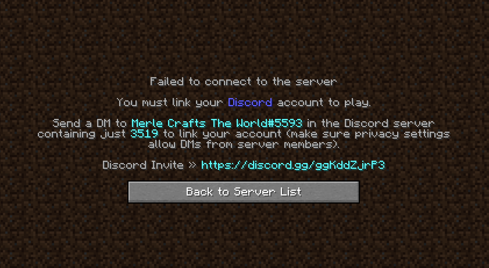
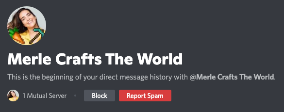
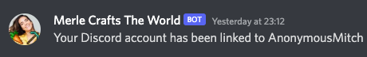
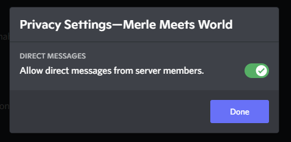

+++
type = "docs"
title = "Joining"
date = 2022-04-19T11:24:09+02:00
description = "How to join Merle's MC server?"
featured = true
toc = false
pinned = true
categories = []
tags = []
series = []
images = []
+++

# Server details
- **IP**: play.merlecraft.ga (or 15.235.17.245)
- **Port**: 25565 (required for Bedrock) 
- **Difficulty**: Easy with PvP disabled
- **Game Version**: 1.18.2
- **Location**: USA 

# Required roles

As of right now, you must have one of the following Discord roles to join the server:
- Admin
- Mods
- Twitch Mods
- Twitch Subscriber (any tier)

# DiscordSRV

We use DiscordSRV to link Minecraft accounts with Discord, as we only allow certain roles to join. When you connect to the server for the first time, you'll see a message like this: 
> 

The next step is to contact our Discord bot that handles verification: 
> 

Just message it the code you received before, in this case `3519` and your account will be linked, and you'll be able to play if you have the required Discord roles.
> 

---

**Note**: If you are unable to message the bot, make sure that you allow direct messages from server members, otherwise you cannot send it a message. 😅
> 
