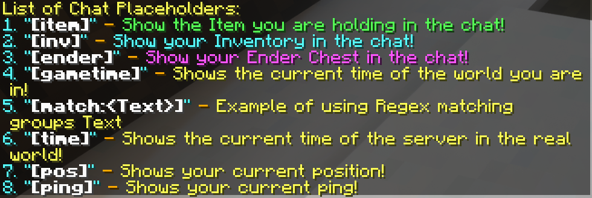

+++
type = "docs"
title = "Plugins"
date = 2022-04-20T00:00:00+02:00
description = "Find out what plugins we use!"
toc = true
+++

## Chat

### [DiscordSRV](https://docs.discordsrv.com/)

Allows us to link a Discord channel and the Minecraft in-game chat together. This is useful for both the staff and regular players. The staff/members can chat to players without being in the game and the staff can check that everything is going well.

It also allows us to use _Discord for proximity voice chat_, for more information, checkout it's [dedicated post]().

### [InteractiveChat](https://www.spigotmc.org/resources/interactivechat-show-items-inventory-in-chat-custom-chat-keywords-bungee-velocity-support.75870/)

_The chat is great, players can socialize with each other. But here's the thing, why not make it even more interact-able? With this plugin, you will be able to show your item in hand, inventory content and ender chest content with your friends!_

#### Chat placeholders
- Type `[item]` in chat to show off the item in your hand
- Type `[inv]` in chat to show off your inventory
- Type `[ender]` and you'll show off your ender chest

> 

#### Interactive Player Names
- Replace all player names that appear in the chat with interactive content, such as hover messages and click actions.

#### Player Mentioning
- If a player's name is mentioned by another player, they will be notified with a sound and a message.

## Fun

### [Dragon Slayer](https://www.spigotmc.org/resources/dragonslayer.36250/)

_The Dragon will rise again from its ashes! Upon defeating the Mighty Dragon only one true hero will be able to call himself the Dragon Slayer! In his honor a statue will be erected!_

This plugin makes the Ender dragon respawn after about six hours. This to ensure that everyone can have a shot at killing the dragon without having to bother with crafting End Crystals.

> 

### [GSit](https://www.spigotmc.org/resources/gsit-modern-sit-seat-and-chair-lay-and-crawl-plugin-1-14-x-1-18-x.62325/)

Allows you to sit on all kinds of surfaces (stair, slab or carpet) by right-clicking it with an empty hand!

> 

## Tools and Utilities

### [CoreProtect](https://www.spigotmc.org/resources/coreprotect.8631/)

Used by the staff to rollback grievers/mistakes/other mishaps. [A simple tutorial on how to use it](https://www.youtube.com/watch?v=JwijCiueZ3Y).

### [EssentialsX](https://essentialsx.net/)

EssentialsX is a plugin suite for Spigot servers, mostly used for its fine-grain permissions ! We use the following items:
- [AntiBuild](https://wiki.mc-ess.net/wiki/AntiBuild)
- [Chat](https://essentialsx.net/wiki/Module-Breakdown.html#essentialsx-chat0)
- [Protect](https://wiki.mc-ess.net/wiki/Configuration_file#EssentialsProtect)
- [Spawn](https://essentialsx.net/wiki/Module-Breakdown.html#essentialsx-spawn)

### [Harbor](https://www.spigotmc.org/resources/harbor-a-sleep-enhancement-plugin.60088/)

A very simple plugin that makes it easier for players to skip the night and prevent Phantom attacks!

### [Plan](https://www.spigotmc.org/resources/plan-player-analytics.32536/)

A fun and clear tool to monitor how players are playing your server. It displays insights into different aspects on the server such as Online activity, player base and how these change over time. [You can checkout the data right here](http://play.merlecraft.ga:3677/)!

### [Spark](https://www.spigotmc.org/resources/spark.57242/)

Allows the server admins to:
- Diagnose performance issues.
- Diagnose memory issues.
- Keep track of overall server health.

### [UltimateAutoRestart ](https://www.spigotmc.org/resources/1-8-1-18-ultimateautorestart-need-an-autorestart-plugin-grab-the-best-one-today.64414/)

Used by the staff to schedule/force restarts of the server, which have to happen from time to time.

## Universal

### [Geyser](https://wiki.geysermc.org/geyser/) + [Floodgate](https://wiki.geysermc.org/floodgate/)

A special plugin that allows Bedrock to join this server who have purchased the Bedrock edition Java.

To prevent duplicate names between Java and Bedrock, Bedrock players have the prefix `.` in front of their name.

### [LuckPerms](https://luckperms.net/) + [Vault](https://www.spigotmc.org/resources/vault.34315/)

A permission plugin for Minecraft servers used by the server admins to control what features players can use by creating groups and assigning permissions.

## World Management

### [Chunky](https://www.spigotmc.org/resources/chunky.81534/)

Used for chunk generation, so that it doesn't have to be done when a user enters a new chunk within the world border.

### [GriefProtection](https://www.spigotmc.org/resources/griefprevention.1884/)

GriefPrevention is the primary protection plugin used. If you wish to protect your land from others, you must claim the land through this plugin. This is an important aspect of the server as it allows you to protect your items from other players, stopping griefing and loss of progress.

Checkout the [dedicated post]() on how to use GriefProtection to claim land.

### [LightCleaner](https://www.spigotmc.org/resources/light-cleaner.42469/)

Light cleaner is a simple plugin centered around regenerating lighting to resolve bad lightning that happens at times in Minecraft.

> 

---

**Note**: any plugins or features can be removed at any time if they malfunction or cause lag.
