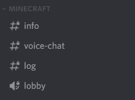
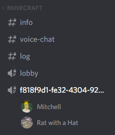

+++
type = "docs"
title = "Voice Chat"
date = 2022-04-18T00:00:00+02:00
description = "Instructions on how to use the Discord powered proximity voice chat"
toc = false
+++

As we are using [DiscordSRV](https://docs.discordsrv.com/), it is possible to use Discord for proximity voice chat.

If you want to participate in the voice chat, all you need to do is join the `#lobby` in the `Minecraft`-category:
> 

After joining the lobby, you'll be automatically muted/suppressed by the bot, until you are near another player. When that happens , the bot will create a new voice channel and move all nearby players together and allow you to speak.
> 